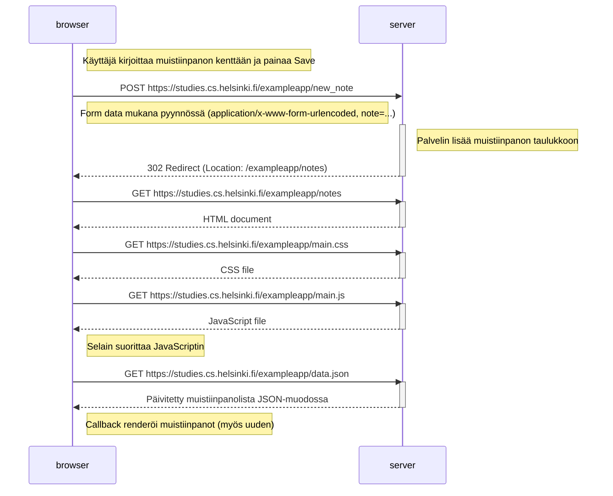

# 0.4: uusi muistiinpano

```mermaid
sequenceDiagram
    participant browser
    participant server

    Note right of browser: Käyttäjä kirjoittaa muistiinpanon kenttään ja painaa Save

    browser->>server: POST https://studies.cs.helsinki.fi/exampleapp/new_note
    Note right of browser: Form data mukana pyynnössä (application/x-www-form-urlencoded, note=...)
    activate server
    Note right of server: Palvelin lisää muistiinpanon taulukkoon
    server-->>browser: 302 Redirect (Location: /exampleapp/notes)
    deactivate server

    browser->>server: GET https://studies.cs.helsinki.fi/exampleapp/notes
    activate server
    server-->>browser: HTML document
    deactivate server

    browser->>server: GET https://studies.cs.helsinki.fi/exampleapp/main.css
    activate server
    server-->>browser: CSS file
    deactivate server

    browser->>server: GET https://studies.cs.helsinki.fi/exampleapp/main.js
    activate server
    server-->>browser: JavaScript file
    deactivate server

    Note right of browser: Selain suorittaa JavaScriptin

    browser->>server: GET https://studies.cs.helsinki.fi/exampleapp/data.json
    activate server
    server-->>browser: Päivitetty muistiinpanolista JSON-muodossa
    deactivate server

    Note right of browser: Callback renderöi muistiinpanot (myös uuden)
```
