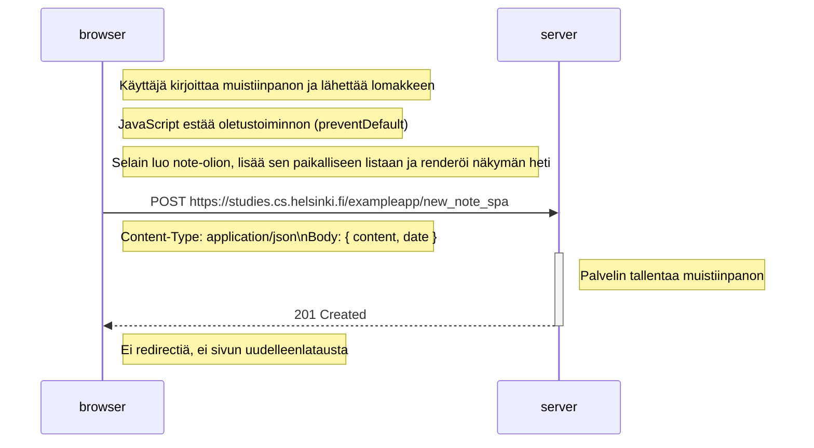

# 0.6: Uusi muistiinpano SPA-versiossa

```mermaid
sequenceDiagram
    participant browser
    participant server

    Note right of browser: Käyttäjä kirjoittaa muistiinpanon ja lähettää lomakkeen
    Note right of browser: JavaScript estää oletustoiminnon (preventDefault)
    Note right of browser: Selain luo note-olion, lisää sen paikalliseen listaan ja renderöi näkymän heti

    browser->>server: POST https://studies.cs.helsinki.fi/exampleapp/new_note_spa
    Note right of browser: Content-Type: application/json\nBody: { content, date }
    activate server
    Note right of server: Palvelin tallentaa muistiinpanon
    server-->>browser: 201 Created
    deactivate server

    Note right of browser: Ei redirectiä, ei sivun uudelleenlatausta
```
